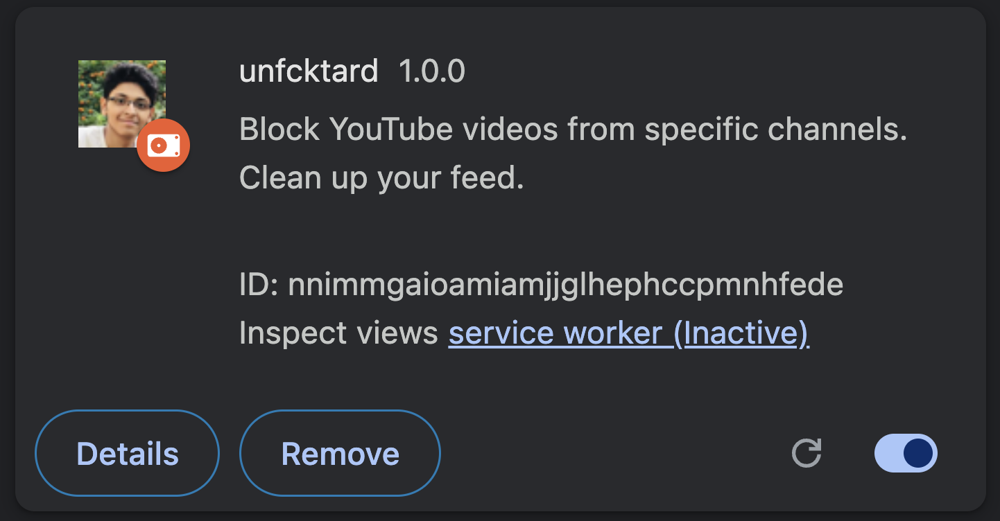
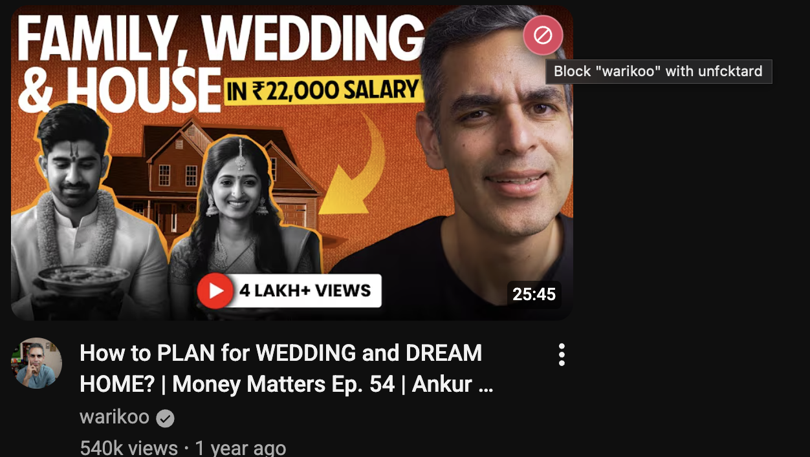
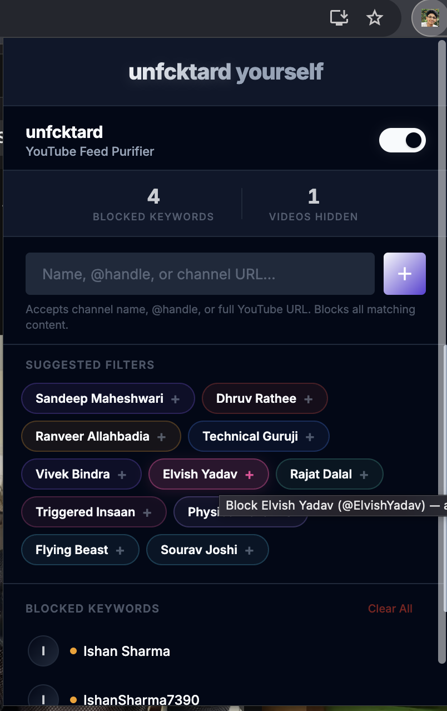

# Unfcktard 

A Chrome extension that blocks YouTube videos from specific channels. Clean up your feed, eliminate noise, take back control.



## Features

- **Channel Blocklist** — Add channel names or `@handles` to block
- **Real-time Blocking** — Videos are hidden instantly as you browse YouTube
- **Quick Block** — Hover over any video to reveal a one-click block button
- **Smart Detection** — Works on home page, search results, sidebar recommendations, and Shorts
- **SPA Aware** — Handles YouTube's client-side navigation seamlessly
- **Synced Storage** — Blocklist syncs across Chrome instances via `chrome.storage.sync`
- **Toggle On/Off** — Disable blocking temporarily without losing your list

## Installation

1. Clone or download this repository
2. Open Chrome and navigate to `chrome://extensions/`
3. Enable **Developer mode** (toggle in top-right)
4. Click **Load unpacked**
5. Select the `unfucktard` directory
6. The extension icon appears in your toolbar — click it to manage blocked channels

## Usage

### From the Popup
1. Click the extension icon in your Chrome toolbar
2. Type a channel name or `@handle` in the input field
3. Press Enter or click the **+** button
4. The channel is now blocked — videos from that channel will be hidden on YouTube

### Quick Block (on YouTube)



1. Hover over any video on YouTube
2. A small 🚫 button appears next to the channel name
3. Click it to instantly add that channel to your blocklist

### Unblocking
- Open the popup and click the **✕** button next to any channel to unblock it

## Project Structure

```
unfucktard/
├── manifest.json              # Extension manifest (MV3)
├── background/
│   └── background.js          # Service worker: storage & messaging
├── content/
│   ├── content.js             # Content script: DOM scanning & blocking
│   └── content.css            # Styles for placeholders & quick-block UI
├── popup/
│   ├── popup.html             # Popup UI
│   ├── popup.js               # Popup logic
│   └── popup.css              # Popup styling
└── icons/
    ├── icon16.png
    ├── icon48.png
    └── icon128.png
```

## How It Works

1. **Content script** runs on all YouTube pages
2. A `MutationObserver` watches for new video elements added to the DOM
3. For each video, the channel name and `@handle` are extracted
4. If the channel matches any entry in the blocklist, the video is hidden and replaced with a subtle placeholder
5. YouTube's SPA navigation triggers a re-scan via the `yt-navigate-finish` event


